# Svelte 5 Component-Based Conversion Plan

## Overview
Convert the existing HTML landing page for Mimar.id (ERP Konstruksi & Real Estate Indonesia) into a Svelte 5 component-based architecture using TypeScript.

## Component Architecture

```mermaid
graph TB
    App[App.svelte] --> Navbar[components/layout/Navbar.svelte]
    App --> Hero[components/sections/Hero.svelte]
    App --> LogoCloud[components/sections/LogoCloud.svelte]
    App --> Features[components/sections/Features.svelte]
    App --> SolutionTabs[components/sections/SolutionTabs.svelte]
    App --> DemoForm[components/sections/DemoForm.svelte]
    App --> Footer[components/layout/Footer.svelte]
    
    Hero --> DashboardMockup[components/sections/Hero/DashboardMockup.svelte]
    
    Features --> FeatureCard1[components/sections/Features/FeatureCard.svelte]
    Features --> FeatureCard2[components/sections/Features/FeatureCard.svelte]
    Features --> FeatureCard3[components/sections/Features/FeaturesCard.svelte]
    Features --> FeatureCard4[components/sections/Features/FeatureCard.svelte]
    Features --> FeatureCard5[components/sections/Features/FeatureCard.svelte]
    Features --> FeatureCard6[components/sections/Features/FeatureCard.svelte]
    
    SolutionTabs --> TabContent[components/sections/SolutionTabs/TabContent.svelte]
    SolutionTabs --> GanttChart[components/sections/SolutionTabs/GanttChart.svelte]
    SolutionTabs --> SitePlan[components/sections/SolutionTabs/SitePlan.svelte]
    
    Navbar --> Button[components/ui/Button.svelte]
    Navbar --> Icon[components/ui/Icon.svelte]
    Hero --> Button
    DemoForm --> Button
    Footer --> Icon
```



## Project Structure

```
src/
├── lib/
│   ├── components/
│   │   ├── ui/
│   │   │   ├── Button.svelte          # Reusable button component
│   │   │   └── Icon.svelte            # Wrapper for lucide-svelte icons
│   │   ├── layout/
│   │   │   ├── Navbar.svelte          # Navigation with mobile menu
│   │   │   └── Footer.svelte          # Footer with links
│   │   └── sections/
│   │       ├── Hero.svelte            # Hero section with CTA
│   │       │   └── DashboardMockup.svelte  # Dashboard preview
│   │       ├── LogoCloud.svelte       # Social proof logos
│   │       ├── Features.svelte        # Features grid
│   │       │   └── FeatureCard.svelte  # Individual feature card
│   │       ├── SolutionTabs.svelte    # Tabbed solutions section
│   │       │   ├── TabContent.svelte  # Tab content wrapper
│   │       │   ├── GanttChart.svelte  # Gantt chart visualization
│   │       │   └── SitePlan.svelte    # Site plan visualization
│   │       └── DemoForm.svelte        # Demo request form
│   └── types.ts                       # TypeScript type definitions
├── App.svelte                         # Main app component
├── app.css                            # Global styles
└── main.ts                            # Entry point
```

## Implementation Steps

### Phase 1: Setup & Configuration

1. **Install lucide-svelte package**
   - Replace the CDN-based lucide icons with the Svelte-compatible package

2. **Update tailwind.config.js**
   - Add custom color scheme (primary: blue shades, accent: amber/orange)
   - Configure the theme to match the original design

3. **Update src/app.css**
   - Add custom utility classes: `.glass-nav`, `.blob`, `.text-gradient`
   - Set up Plus Jakarta Sans font family
   - Configure smooth scrolling

4. **Create src/lib/types.ts**
   - Define TypeScript interfaces for:
     - Feature data structure
     - Tab content data structure
     - Form data structure
     - Navigation link structure

### Phase 2: Shared UI Components

5. **Create src/lib/components/ui/Button.svelte**
   - Props: `variant` (primary, secondary, accent), `size`, `href`, `type`
   - Slots for icon and text content
   - Hover and focus states

6. **Create src/lib/components/ui/Icon.svelte**
   - Props: `name` (icon name), `size`, `class`
   - Wrapper around lucide-svelte icons

### Phase 3: Layout Components

7. **Create src/lib/components/layout/Navbar.svelte**
   - State: `isMobileMenuOpen` (boolean)
   - Logo component
   - Desktop navigation links
   - Mobile menu toggle button
   - Mobile menu panel (hidden/shown based on state)
   - Glass navigation effect

8. **Create src/lib/components/layout/Footer.svelte**
   - Company info and social links
   - Product links
   - Company links
   - Office address and contact info
   - Copyright and legal links

### Phase 4: Page Section Components

9. **Create src/lib/components/sections/Hero.svelte**
   - Badge component (#1 ERP Konstruksi Indonesia)
   - Main heading with gradient text
   - Description paragraph
   - CTA buttons (primary and secondary)
   - Trust indicators (no setup fee, 24/7 support)
   - Import DashboardMockup component

10. **Create src/lib/components/sections/Hero/DashboardMockup.svelte**
    - Mockup header with window controls
    - Project progress card with progress bar
    - Budget remaining card
    - Payment term card
    - Pending approvals list
    - Floating efficiency badge

11. **Create src/lib/components/sections/LogoCloud.svelte**
    - Section heading
    - Grid of company logos (using icons + text)
    - Grayscale to color hover effect

12. **Create src/lib/components/sections/Features.svelte**
    - Section heading and description
    - Grid of 6 feature cards
    - Import FeatureCard component

13. **Create src/lib/components/sections/Features/FeatureCard.svelte**
    - Props: `icon`, `title`, `description`, `color`
    - Icon container with hover effect
    - Title and description text
    - Hover shadow effect

14. **Create src/lib/components/sections/SolutionTabs.svelte**
    - State: `activeTab` ('kontraktor' | 'developer')
    - Tab buttons (Kontraktor, Developer)
    - Tab content area (switches based on state)
    - Import TabContent, GanttChart, and SitePlan components

15. **Create src/lib/components/sections/SolutionTabs/TabContent.svelte**
    - Props: `type` ('kontraktor' | 'developer')
    - Quote text
    - List of features with check icons
    - "Learn more" link

16. **Create src/lib/components/sections/SolutionTabs/GanttChart.svelte**
    - Abstract Gantt chart visualization
    - Progress bars for different work phases
    - Used for Kontraktor tab

17. **Create src/lib/components/sections/SolutionTabs/SitePlan.svelte**
    - Abstract site plan grid visualization
    - Unit status indicators (SOLD, BOOKED, AVAILABLE)
    - Used for Developer tab

18. **Create src/lib/components/sections/DemoForm.svelte**
    - Section with gradient background
    - Form fields: name, company, WhatsApp, business type
    - Form submission handler
    - Benefits list

### Phase 5: Integration

19. **Update src/App.svelte**
    - Import all section components
    - Arrange components in proper order
    - Remove default Vite/Svelte template content
    - Add smooth scroll behavior

20. **Update index.html**
    - Add proper meta tags
    - Remove inline Tailwind CDN (using Vite build)
    - Remove inline Lucide script (using package)
    - Keep Google Fonts link

### Phase 6: Testing

21. **Test the application**
    - Run `npm run dev`
    - Verify all sections render correctly
    - Test mobile menu toggle
    - Test tab switching functionality
    - Test form submission
    - Verify responsive design
    - Check all icons display correctly

## Key Considerations

### Svelte 5 Features
- Use Svelte 5's new runes (`$state`, `$derived`, `$effect`) where appropriate
- Leverage TypeScript for type safety
- Use `<script lang="ts">` for all components

### State Management
- Mobile menu: Local state in Navbar component
- Tabs: Local state in SolutionTabs component
- Form: Local state in DemoForm component

### Styling
- Tailwind CSS for utility classes
- Custom CSS in `<style>` blocks for specific effects (glass-nav, blob, animations)
- Consistent use of primary and accent color palette

### Icons
- Use `lucide-svelte` package instead of CDN
- Create Icon wrapper component for consistent sizing and styling

### Accessibility
- Proper ARIA labels for interactive elements
- Keyboard navigation support
- Semantic HTML structure

## Dependencies to Install

```bash
npm install lucide-svelte
```

## Files to Modify

- `package.json` (add lucide-svelte dependency)
- `tailwind.config.js` (add custom colors)
- `src/app.css` (add custom styles)
- `src/App.svelte` (main integration)
- `index.html` (update meta tags, remove CDNs)

## Files to Create

All component files as outlined in the project structure above, plus:
- `src/lib/types.ts` (TypeScript definitions)

## Expected Outcome

A fully functional, component-based Svelte 5 application that:
- Matches the original HTML design exactly
- Uses TypeScript for type safety
- Has a clean, maintainable component architecture
- Supports responsive design
- Includes all interactive features (mobile menu, tabs, form)
- Uses modern Svelte 5 patterns
